# AI Chatbot Supporting Information For Dormitory

## The content of the project includes:
-	Build basic neural network chatbot according to Retrieval-Base model.

-	Develop methods to store and organize database systems.

-	Build algorithms to retrieve information in accordance with user requirements.

-	Build methods to communicate with users by text, audio through website, Facebook messenger.

Here is a [website](http://www.ktxbk.vn/) of Domitory.

And here is a website I have made and added my Chatbot to: 

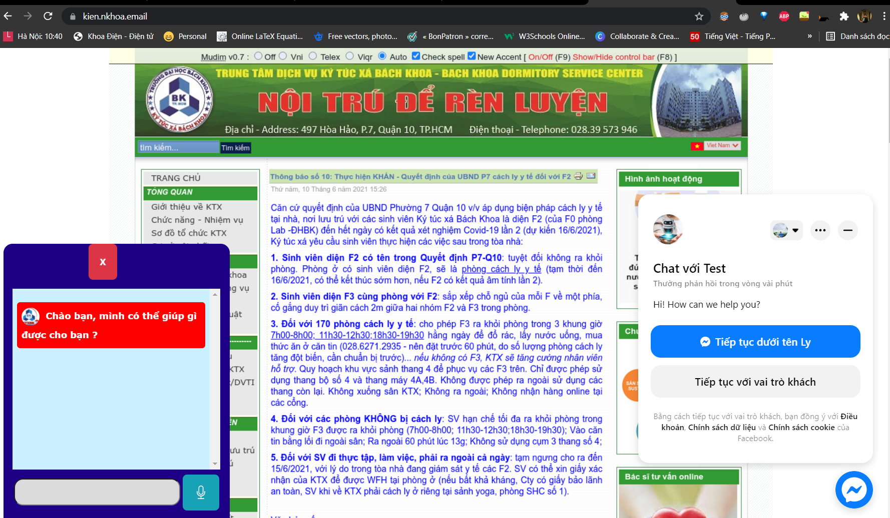

## I.	NEURAL NETWORK MODEL FOR CHATBOT
### A.	Chatbot Overview
The role of blocks will be presented in the following diagram:

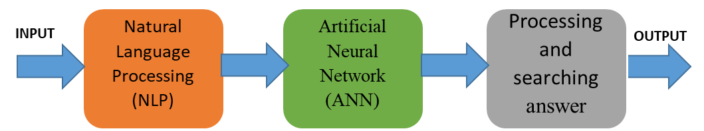

1. NLP block: Remove punctuation, separate words (tokenize), convert words to primitive form (lemmaztize), convert to lower case (lower) and process input sentences into appropriate data as input for the ANN block.
2. ANN block: Performs prediction of input sentences in topic group and predicts which topic in that group based on probability.
3. Processing and searching block: Process and collect information on the output of the ANN block, using algorithms and databases to get the most appropriate answer.
### B.	Neural network construction and training
Before going into the processing in the chatbot, we need to define the process of building the neural network in the ANN. This process consists of 3 steps: building the training set; building structure and parameters for neural network; train, test, and save the model.

***1)	Building the training set:***
First, we build json files to store data according to the following structure:
After having data about the topic group and specific topics, we implement the word creation process using the word_tokenize function in the python nltk library. The job of word splitting is to identify a sentence of text and then split it into the set of words or punctuation it contains. The program will take the data in all the "pattens" (in the json file) in each topic, separate the words and store all the results into a list of "words". At the same time, the list of "documents" names will save the link data of the split results and include the topic name in each corresponding topic keyword. A list of "classes" will store all the topic names in the topic group under consideration.

Next, we filter the punctuation, convert the word to the infinitive form in the "words" list using the lemmatizer function in the ntlk library. The conversion to the infinitive form only applies to languages with variations such as English, French, German, ... and for Vietnamese, there is no change in word form, for example the word "biết", in the past is "đã biết", in English it is “know”, in the past is “knew” or “have known”. So we can skip this process for Vietnamese data.
After that, we deploy to sort the "words" list, then proceed to embed the "words" and "document" lists into the ".pkl" file (Python Pickle File - a type of Developer Files) to keep the state intact of the list as a long stream of bytes. This has the effect that when taking out the data to use, it will not change state, suitable for processing text strings on demand when making predictions with neural networks.

We proceed to create a training set for the network. We first create an empty "train" list containing the input data and its corresponding label. An "output_rempty" list has all zero values and a size equal to the number of topics in the topic pool. We create an empty list of "bag" and "patten_words" containing specific keywords in each topic, compared to the list of words in "words" and if they match, save it in "bag". Next we create an output list "output_row" equal to the size of "output_empty" and compare it with the topic under consideration. Finally put "bag" and "output_row" data into "train".

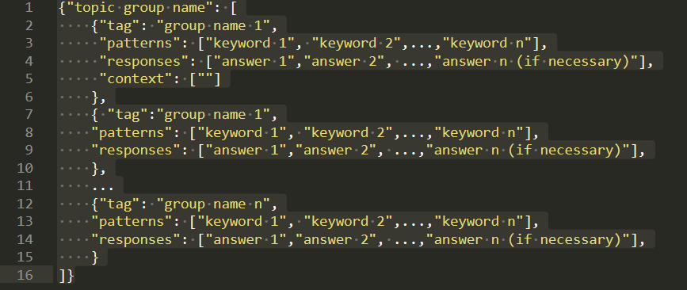

***2)	Neural network design and training***

The process of designing an artificial neural network is as follows:
- The input data consists of a number of lists with the number of elements equal to the size of the set "words" with a dimension. The input layer has 256 network nodes with the activation function "ReLU". The middle layer consists of 128 network layers with the activation function "ReLU". The output layer has the number of nodes equal to the number of topics in the topic set (5 topics are applied in this thesis) and the output activation function is "softmax".
- Use a loss function of the form "categorical-rossentropy" with the SGD + NAG optimization method with a momentum factor of 0.82, a learning factor of 0.01 and a delay factor of  10 -8 . Train 200 times with batch-size factor = 5. Network evaluation is based on the number of correct predictions on accuracy and loss function value.
- Conduct training neural network, we have training results as shown below. Based on that result, we find that the models give high accuracy close to 1 and error almost equal. With such a result, threading and topic selection will be almost exactly the same as the request from the input. About the threading algorithm as well as the search algorithm will be presented in the following section. 

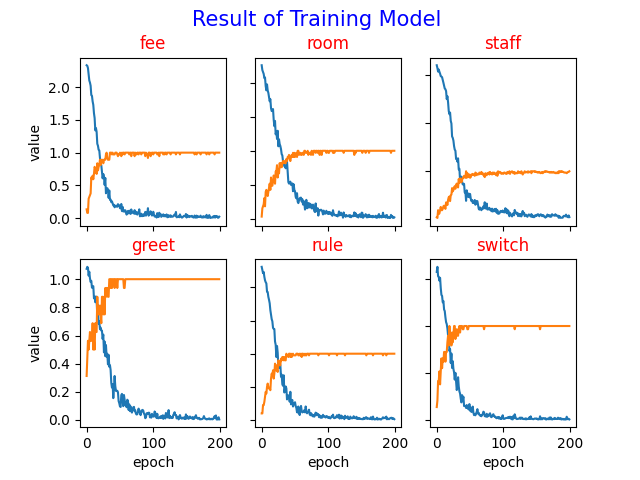

### C.	Input processing and threading

After building and training the models, we begin to process the input data to match the input of the neural network. The process of input data processing is similar to the process of creating a training set for a neural network. First, we separate the word in the sentence, filter the punctuation and convert it to lowercase. Next, we create a place to collect the words that are both in the sentence and in the list of "works" saved in pickle form. Then convert those words into binary network form and as input to the switch model, which returns the request to its subject model. Here, the system includes the following models:

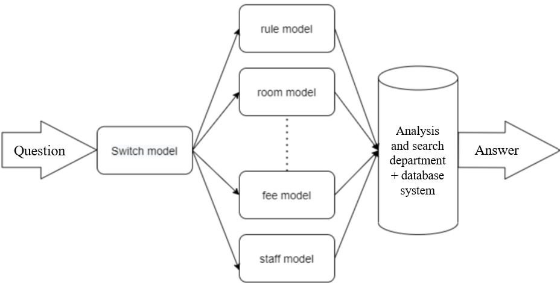

-	greet: This model simply responds to simple sentences like hello, thank you or goodbye to make it feel more friendly and natural.
-	fee: This model helps us to answer questions related to service fees in the Dormitory.
-	room: This model helps us to answer questions related to the type of room and its location in the Dormitory.
-	staff: This model helps us answer questions related to the staff working in the Dormitory.
-	rule: This model helps us to answer 

## II.	USER COMMUNICATION METHOD

The process of processing communication with text and voice.

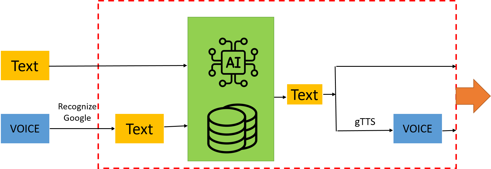

### Web interface

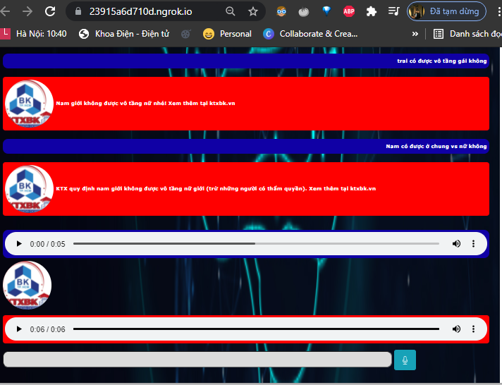

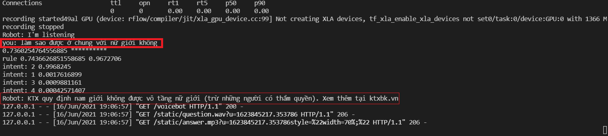

### Facebook messenger

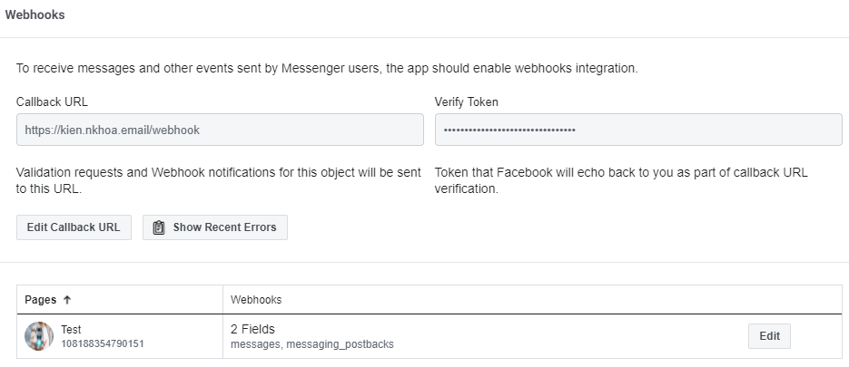

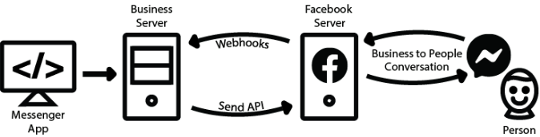

## III. DATABASE SYSTEM
### A.	Database Management System (DBMS)
The ER diagram as follows:

### B.	Building a Database in MySQL

## IV.	Web server
To do this project, I rented a cloud server from the website: https://my.cloudfly.vn/ with the following machine configuration:

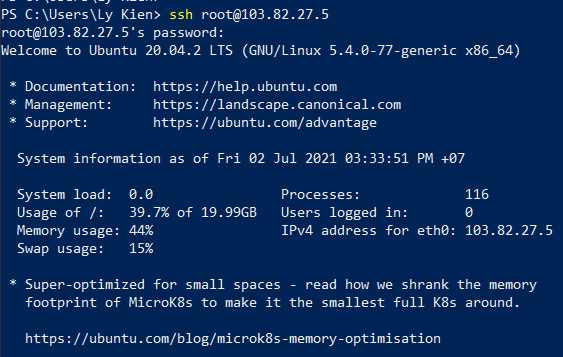

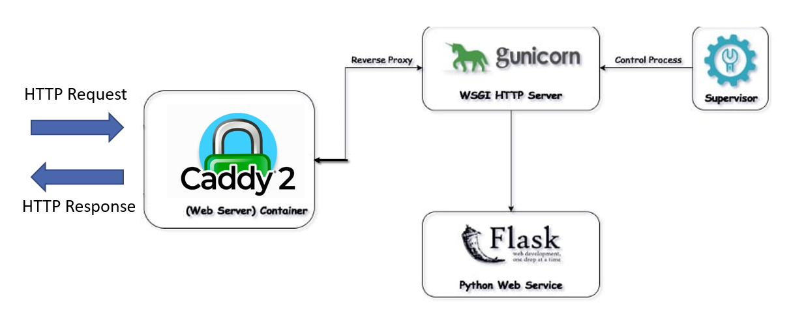

1.	Caddy

In this thesis, I used Caddy server to configure my applications. Caddy is a server of servers (most people use Caddy as a web server or proxy), written in the Go language. With the necessary modules, it can take on the role of any lengthy processing.
Configurations are both dynamic and exportable with Caddy's API. Although no configuration files are required, you can still use them; The format of the configuration document comes in many forms with the configuration adapter, but Caddy's native configuration language is JSON. Most people's favorite way of configuring Caddy is to use the Caddyfile. And in this thesis I also use Caddyfile to configure my server.

2.  Gunicorn

Gunicorn ‘Green Unicorn’ is a Python WSGI HTTP Server for UNIX. It’s a pre-fork worker model ported from Ruby’s Unicorn project. The Gunicorn server is broadly compatible with various web frameworks, simply implemented, light on server resources, and fairly speedy [5]. Gunicorn is easy to use and supports many different web frameworks like Django, Flask... 

3. Supervisor

Supervisor is a client/server system that allows its users to control a number of processes on UNIX-like operating systems. Supervisor is useful tool to monitor and control Gunicorn. I have configured Gunicorn simply with supervisor at port 8080.

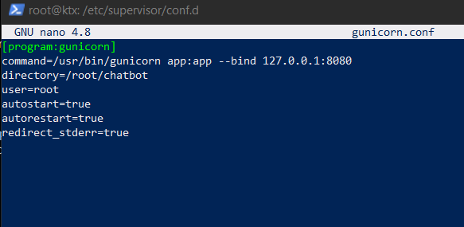

